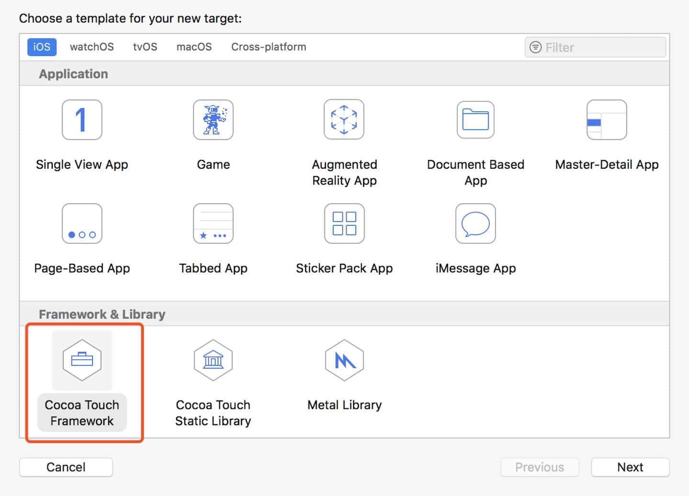
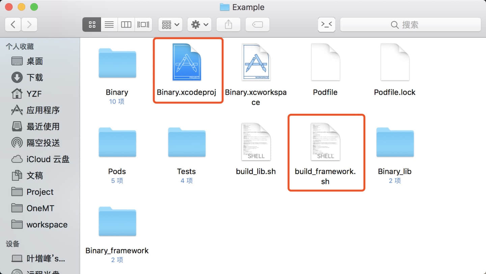
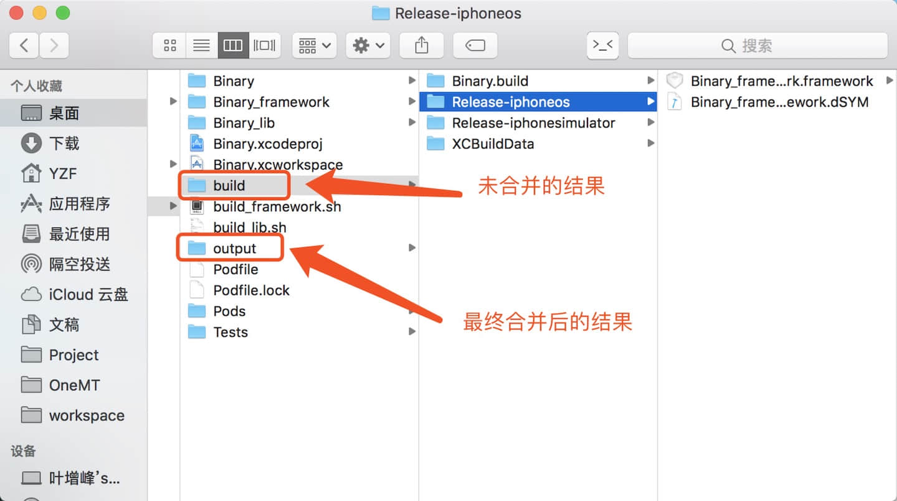
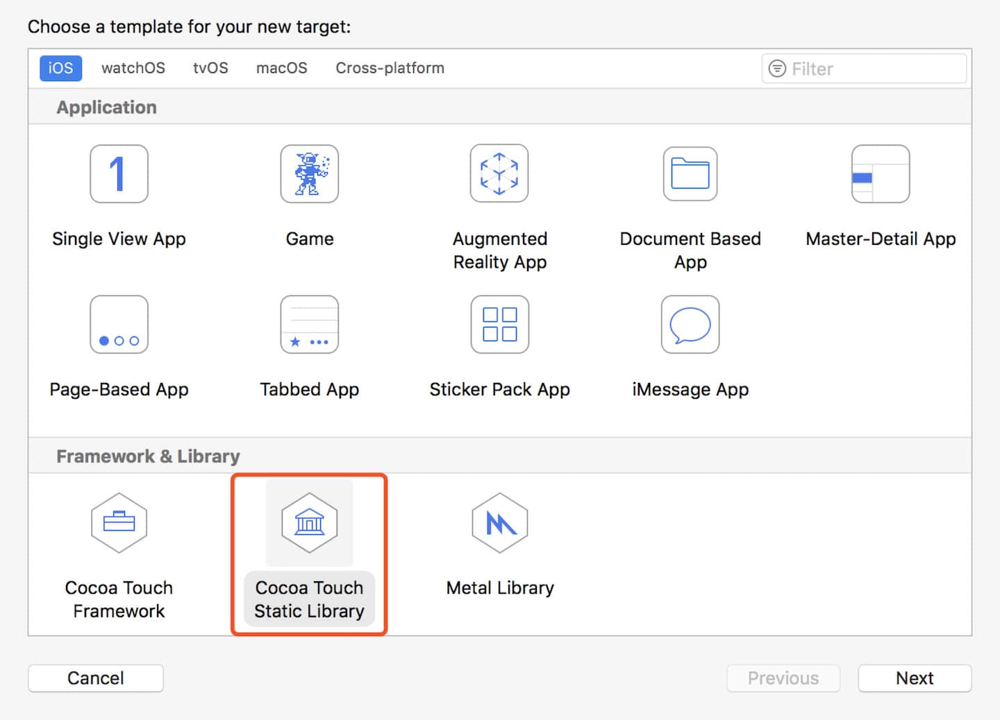
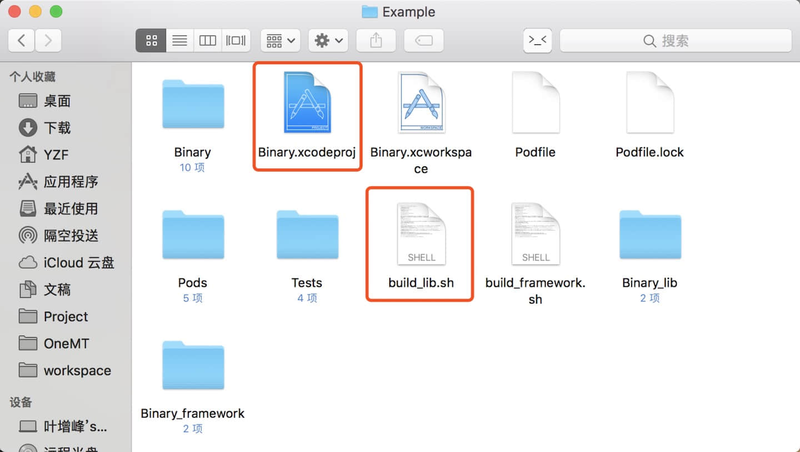
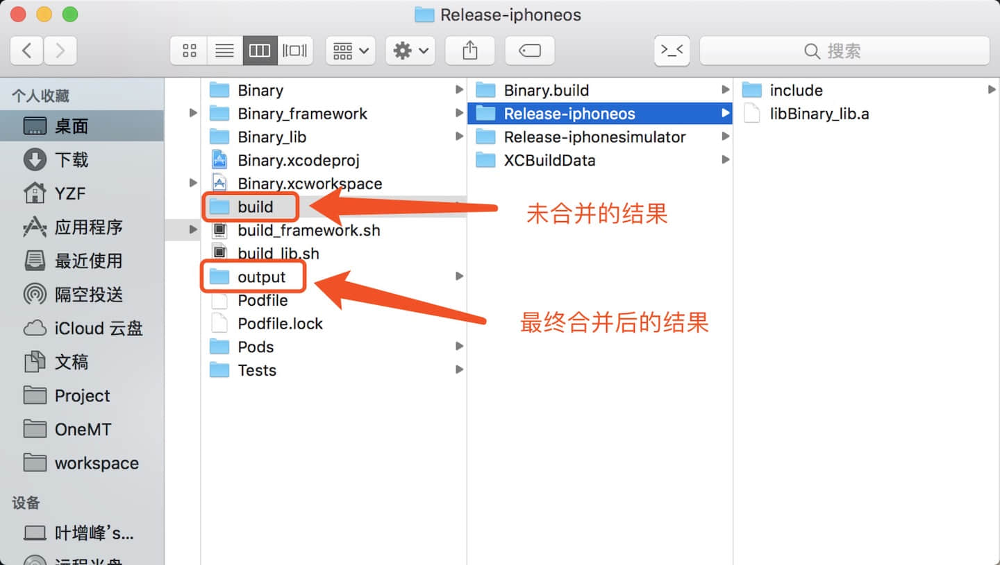
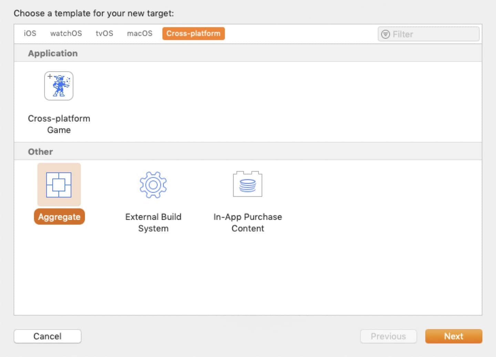
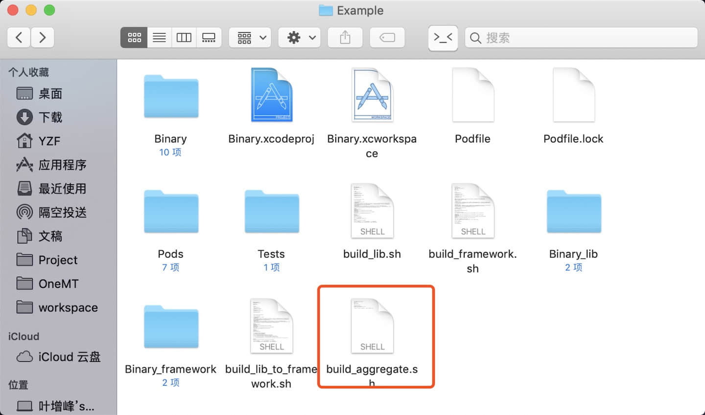

## Shell 制作 framework .a 文件

介绍了在项目根目录下执行 shell 脚本制作静态库（包含 pod 的依赖）的方法
测试环境：

* Xcode 10
* CocoaPods 1.6.0
* iOS 12

### 一、制作 framework

#### 1.创建 Target (名称为 Binary_framework)


#### 2.修改 Podfile 添加依赖
##### 注意：
* Podfile 文件中不能没有制作 .a 静态库的限制，可以直接给 target Binary_framework 添加 pod 依赖。以下写法是允许的。
```ruby
# 该写法是允许的
target 'Binary_framework' do
    pod 'AFNetworking'
end
```

#### 3.在 .xcodeproj 目录下创建脚本


#### 4.运行脚本

##### 说明：
看起来脚本很长，核心只有两行
* `xcodebuild -workspace "${WORKSPACE}" -scheme "${SCHEME}"`
功能等同于 xcode 选择相应 scheme（就是 target）点击编辑，此外的都是编译相关的参数
* `lipo -create "${IPHONEOS_PATH}" "${SIMULATOR_PATH}"  -output "${OUTPUT_PATH}"`
功能是合并真机和模拟器的 framework 为一个通用的

##### 注意：
* 脚本中 PROJECT_NAME 和 TARGET_NAME 按照项目实际情况填写
* 因为 target 可能有多个，不是固定的，可以在执行脚本的是传入参数指定需要编译的 target。如`./build_framework.sh targetName`，那么就会编译叫做 targetName 的 target 

```bash
#要build的target名
TARGET_NAME="Binary_framework"
if [[ $1 ]]
then
TARGET_NAME=$1
fi

# 项目名
PROJECT_NAME="Binary"

# 模拟器支持架构,i386 x86_64
SIMULATOR_ARCHS="x86_64" 

# 真机支持架构,armv7 armv7s arm64
IPHONEOS_ARCHS="arm64"

CONFIGURATION="Release"

#构建一个xcode工作空间，你必须通过-workspace和-scheme定义这个构建。scheme参数控制哪一个targets被构建如何被构建
WORKSPACE="${PROJECT_NAME}.xcworkspace"
SCHEME="${TARGET_NAME}"

# 编译真机的Framework
xcodebuild -workspace "${WORKSPACE}" -scheme "${SCHEME}" ARCHS="${IPHONEOS_ARCHS}" -configuration "${CONFIGURATION}" -sdk "iphoneos" clean build CONFIGURATION_BUILD_DIR="build/${CONFIGURATION}-iphoneos" LIBRARY_SEARCH_PATHS="./Pods/build/${CONFIGURATION}-iphoneos"

#编译模拟器的Framework
xcodebuild -workspace "${WORKSPACE}" -scheme "${SCHEME}" ARCHS="${SIMULATOR_ARCHS}" -configuration "${CONFIGURATION}" -sdk "iphonesimulator" clean build CONFIGURATION_BUILD_DIR="build/${CONFIGURATION}-iphonesimulator" LIBRARY_SEARCH_PATHS="./Pods/build/${CONFIGURATION}-iphonesimulator"

# 创建输出目录，并删除之前的framework文件
OUTPUT_DIR="output"
mkdir -p "${OUTPUT_DIR}"

# 执行 xcodebuild 会在该目录下生成 framework
BUILD_DIR="build"

#拷贝framework到 output 目录
cp -R "${BUILD_DIR}/${CONFIGURATION}-iphonesimulator/${TARGET_NAME}.framework" "${OUTPUT_DIR}"

#真机静态库路径
IPHONEOS_PATH="${BUILD_DIR}/${CONFIGURATION}-iphoneos/${TARGET_NAME}.framework/${TARGET_NAME}"
#模拟器静态库路径
SIMULATOR_PATH="${BUILD_DIR}/${CONFIGURATION}-iphonesimulator/${TARGET_NAME}.framework/${TARGET_NAME}"
#输出路径
OUTPUT_PATH="${OUTPUT_DIR}/${TARGET_NAME}.framework/${TARGET_NAME}"

#合并framework，输出最终的framework到output目录
lipo -create "${IPHONEOS_PATH}" "${SIMULATOR_PATH}"  -output "${OUTPUT_PATH}" 

# 删除 build 文件夹
# rm -rf "${BUILD_DIR}"

#打开合并后的文件夹
# open "${OUTPUT_DIR}"
```

#### 5.结果



### 二、制作 .a 静态库

#### 1.创建 Target (名称为 Binary_lib)


#### 2.修改 Podfile 添加依赖
##### 注意：
* Podfile 文件中不能以 Binary_lib 为 target pod 依赖库，否则会造成目录改变打包失败，暂时不知道原因。但是若通过 Aggregate 创建脚本打包则没有这个问题。如下注释
```ruby
target 'Binary_Example' do
  pod 'Binary', :path => '../'
  # ⚠️⚠️⚠️ 可以在这添加
  pod 'AFNetworking'

  target 'Binary_Tests' do
    inherit! :search_paths

  end
end

# ⚠️⚠️⚠️ Binary_lib 不能作为 target 使用，要 pod 依赖库可以在上面的 Binary_Example 添加或者新建一个 Test 的 target 添加。
#target 'Binary_lib' do
#    pod 'AFNetworking'
#end
```

#### 3.在 .xcodeproj 目录下创建脚本



#### 4.运行脚本
##### 注意：
* 脚本中 PROJECT_NAME 和 TARGET_NAME 按照项目实际情况填写
* xcodebuild 命令中的参数 `CONFIGURATION_BUILD_DIR`、`LIBRARY_SEARCH_PATHS`、`HEADER_SEARCH_PATHS` 不是必须的，正常的 `pod install` 命令会在 Build Settings 中的将这些参数设置好。但是有时候若 Build Settings 没有设置，xcodebuild 命令中加上以上参数可以保证不会找不到 pod 的依赖库。

##### 脚本:

```bash
#要build的target名
TARGET_NAME="Binary_lib"
if [[ $1 ]]
then
TARGET_NAME=$1
fi

# 项目名
PROJECT_NAME="Binary"

# 模拟器支持架构,i386 x86_64
SIMULATOR_ARCHS="x86_64" 
#
# 真机支持架构,armv7 armv7s arm64
IPHONEOS_ARCHS="arm64"

CONFIGURATION="Release"

PROJECT=${PROJECT_NAME}.xcodeproj

TARGET="${TARGET_NAME}"

# 制作的静态库在根目录的 build 文件夹下，一下命令中 CONFIGURATION_BUILD_DIR、LIBRARY_SEARCH_PATHS、HEADER_SEARCH_PATHS 不是必须
# 制作真机的静态库
xcodebuild -project $PROJECT -target $TARGET -sdk "iphoneos" -configuration $CONFIGURATION ARCHS="${IPHONEOS_ARCHS}" build CONFIGURATION_BUILD_DIR="build/${CONFIGURATION}-iphoneos" LIBRARY_SEARCH_PATHS="./Pods/build/${CONFIGURATION}-iphoneos" HEADER_SEARCH_PATHS="./Pods/Headers/Public"
# 制作模拟器的静态库
xcodebuild -project $PROJECT -target $TARGET -sdk "iphonesimulator" -configuration $CONFIGURATION ARCHS="${SIMULATOR_ARCHS}" build CONFIGURATION_BUILD_DIR="build/${CONFIGURATION}-iphonesimulator" LIBRARY_SEARCH_PATHS="./Pods/build/${CONFIGURATION}-iphonesimulator" HEADER_SEARCH_PATHS="./Pods/Headers/Public"

#静态库名
LIB_NAME="lib${TARGET}.a"
#真机静态库路径
IPHONEOS_PATH="build/${CONFIGURATION}-iphoneos/${LIB_NAME}"
#模拟器静态库路径
SIMULATOR_PATH="build/${CONFIGURATION}-iphonesimulator/${LIB_NAME}"
#include 路径
INCLUDE_PATH="build/${CONFIGURATION}-iphoneos/include"

#输出文件夹
OUTPUT_DIR="output"
#创建输出文件夹
mkdir -p "${OUTPUT_DIR}"

#复制 include 移至输出文件夹
cp -rp "${INCLUDE_PATH}" "${OUTPUT_DIR}"

#输出路径
OUTPUT_PATH="${OUTPUT_DIR}/${LIB_NAME}"

#合并真机、模拟器静态库为一个，-create 输入两个静态库的路径，-output 输出静态库路径
lipo -create "${IPHONEOS_PATH}" "${SIMULATOR_PATH}" -output "${OUTPUT_PATH}"

```

#### 5.结果



### 三、制作 .a 静态库后合并成 framework

#### 运行脚本

##### 注意：
* 脚本基本和制作 .a 相同，只是在结尾处将 .a 文件转换成 framework 文件

```bash
#要build的target名
TARGET_NAME="Binary_lib"
if [[ $1 ]]
then
TARGET_NAME=$1
fi

# 项目名
PROJECT_NAME="Binary"

# 模拟器支持架构,i386 x86_64
SIMULATOR_ARCHS="x86_64" 
#
# 真机支持架构,armv7 armv7s arm64
IPHONEOS_ARCHS="arm64"

CONFIGURATION="Release"


PROJECT=${PROJECT_NAME}.xcodeproj

TARGET="${TARGET_NAME}"

# 制作的静态库在根目录的 build 文件夹下
# 制作真机的静态库
xcodebuild -project $PROJECT -target $TARGET -sdk "iphoneos" -configuration $CONFIGURATION ARCHS="${IPHONEOS_ARCHS}" build CONFIGURATION_BUILD_DIR="build/${CONFIGURATION}-iphoneos" LIBRARY_SEARCH_PATHS="./Pods/build/${CONFIGURATION}-iphoneos" HEADER_SEARCH_PATHS="./Pods/Headers/Public"
# 制作模拟器的静态库
xcodebuild -project $PROJECT -target $TARGET -sdk "iphonesimulator" -configuration $CONFIGURATION ARCHS="${SIMULATOR_ARCHS}" build CONFIGURATION_BUILD_DIR="build/${CONFIGURATION}-iphonesimulator" LIBRARY_SEARCH_PATHS="./Pods/build/${CONFIGURATION}-iphonesimulator" HEADER_SEARCH_PATHS="./Pods/Headers/Public"

#静态库名
LIB_NAME="lib${TARGET}.a"
#真机静态库路径
IPHONEOS_PATH="build/${CONFIGURATION}-iphoneos/${LIB_NAME}"
#模拟器静态库路径
SIMULATOR_PATH="build/${CONFIGURATION}-iphonesimulator/${LIB_NAME}"
#include 路径
INCLUDE_PATH="build/${CONFIGURATION}-iphoneos/include"

#输出文件夹
OUTPUT_DIR="output"
#创建输出文件夹
mkdir -p "${OUTPUT_DIR}"

# *************************************
# .a 静态库合并成 framework 静态库所做操作
# *************************************
mkdir -p "${OUTPUT_DIR}/${TARGET}.framework/Versions/A/Headers"
ln -sfh "A" "${OUTPUT_DIR}/${TARGET}.framework/Versions/Current"
ln -sfh "Versions/Current/Headers" "${OUTPUT_DIR}/${TARGET}.framework/Headers"
ln -sfh "Versions/Current/${TARGET}" "${OUTPUT_DIR}/${TARGET}.framework/${TARGET}"

cp -a "build/${CONFIGURATION}-iphoneos/include/${TARGET}/" "${OUTPUT_DIR}/${TARGET}.framework/Versions/A/Headers"

#输出路径
OUTPUT_PATH="${OUTPUT_DIR}/${TARGET}.framework/Versions/A/${TARGET}"

#合并真机、模拟器静态库为一个，-create 输入两个静态库的路径，-output 输出静态库路径
lipo -create "${IPHONEOS_PATH}" "${SIMULATOR_PATH}" -output "${OUTPUT_PATH}"
```

### 四、编译多个 Target

`build_all.sh`

```bash
./build_framework.sh Binary_framework

#./build_framework.sh Binary_framework2
#./build_framework.sh Binary_framework3
#..... 省略
```


## Aggregate 制作 framework .a 文件

介绍了通过 Aggregate 执行 shell 脚本制作静态库（包含 pod 的依赖）的方法
测试环境：
* Xcode 10
* CocoaPods 1.6.0
* iOS 12

### 一、制作 Framework

#### 1.创建 Target（名称：Binary_framework）


#### 2.podfile 导入依赖库

```ruby
use_frameworks!

target 'Binary_Example' do
  pod 'Binary', :path => '../'

  target 'Binary_Tests' do
    inherit! :search_paths

  end
end

target 'Binary_framework' do
    pod 'AFNetworking'
end
```

#### 3.创建 Aggregate（名称：PackageFramework）



#### 4.添加 Run Script 以及脚本
##### 注意：
* 脚本中 TARGET_NAME 按照项目实际情况填写
* 其他参数直接通过环境变量获取
* Xcode 10 下 xcodebuild 命令下参数 OBJROOT 需要做修改，否则编译会报错。[问题详情](https://stackoverflow.com/questions/51153525/xcode-10-unable-to-attach-db-error)
* 因为 target 可能有多个，不是固定的，可以在执行脚本的是传入参数指定需要编译的 target。如`./build_framework.sh targetName`，那么就会编译叫做 targetName 的 target 

##### 脚本：
```bash
#!/bin/sh
#要build的target名
TARGET_NAME="Binary_framework"
if [[ $1 ]]
then
TARGET_NAME=$1
fi

# 模拟器支持架构,i386 x86_64
SIMULATOR_ARCHS="x86_64" 

# 真机支持架构,armv7 armv7s arm64
IPHONEOS_ARCHS="arm64"

CONFIGURATION="Release"

# 构建一个xcode工作空间，你必须通过-workspace和-scheme定义这个构建。scheme参数控制哪一个targets被构建如何被构建
WORKSPACE="${PROJECT_NAME}.xcworkspace"
SCHEME="${TARGET_NAME}"

#分别编译模拟器和真机的Framework
xcodebuild -workspace "${WORKSPACE}" -scheme "${SCHEME}" ARCHS="${IPHONEOS_ARCHS}" -configuration "${CONFIGURATION}" -sdk "iphoneos" build OBJROOT="${OBJROOT}/DependentBuilds"
xcodebuild -workspace "${WORKSPACE}" -scheme "${SCHEME}" ARCHS="${SIMULATOR_ARCHS}" -configuration "${CONFIGURATION}" -sdk "iphonesimulator" build OBJROOT="${OBJROOT}/DependentBuilds"

#创建输出目录，并删除之前的framework文件
OUTPUT_DIR="${SRCROOT}/output/"
mkdir -p "${OUTPUT_DIR}"
rm -rf "${OUTPUT_DIR}/${TARGET_NAME}.framework"

#拷贝 framework 到 output 目录
cp -R "${BUILD_DIR}/${CONFIGURATION}-iphonesimulator/${TARGET_NAME}.framework" "${OUTPUT_DIR}"

#真机静态库路径
IPHONEOS_PATH="${BUILD_DIR}/${CONFIGURATION}-iphoneos/${TARGET_NAME}.framework/${TARGET_NAME}"
#模拟器静态库路径
SIMULATOR_PATH="${BUILD_DIR}/${CONFIGURATION}-iphonesimulator/${TARGET_NAME}.framework/${TARGET_NAME}"
#输出路径
OUTPUT_PATH="${OUTPUT_DIR}/${TARGET_NAME}.framework/${TARGET_NAME}"

#合并framework，输出最终的framework到 output 目录
lipo -create "${IPHONEOS_PATH}" "${SIMULATOR_PATH}"  -output "${OUTPUT_PATH}" 

#打开合并后的文件夹
#open "${OUTPUT_DIR}"
```

#### 5.编译 Aggregate


#### 6.也可以通过脚本编译 Aggregate



##### 注意：
* 可以通过 `./build_framework.sh aggregateName` 编译指定名称的 Aggregate。

```bash
TARGET_NAME="PackageFramework"
if [[ $1 ]]
then
TARGET_NAME=$1
fi

PROJECT_NAME="Binary"

WORKSPACE="${PROJECT_NAME}.xcworkspace"
SCHEME="${TARGET_NAME}"

xcodebuild -workspace "${WORKSPACE}" -scheme "${SCHEME}" build
```


### 二、制作 .a 静态库

整体过程和制作 framework 类似

#### 1.创建 Target（名称：Binary_lib）

#### 2. podfile 导入依赖库

```ruby
use_frameworks!

target 'Binary_Example' do
  pod 'Binary', :path => '../'

  target 'Binary_Tests' do
    inherit! :search_paths

  end
end

target 'Binary_lib' do
    pod 'AFNetworking'
end
```

#### 3.创建 Aggregate（名称：PackageLib）


#### 4.添加 Run Script 以及脚本
```bash
#!/bin/sh
#要build的target名
TARGET_NAME="Binary_lib"
if [[ $1 ]]
then
TARGET_NAME=$1
fi

# 模拟器支持架构,i386 x86_64
SIMULATOR_ARCHS="x86_64" 

# 真机支持架构,armv7 armv7s arm64
IPHONEOS_ARCHS="arm64"

CONFIGURATION="Release"

#创建输出目录，并删除之前的framework文件
OUTPUT_DIR="${SRCROOT}/output/"
mkdir -p "${OUTPUT_DIR}"

# 构建一个xcode工作空间，你必须通过-workspace和-scheme定义这个构建。scheme参数控制哪一个targets被构建如何被构建
WORKSPACE="${PROJECT_NAME}.xcworkspace"
SCHEME="${TARGET_NAME}"

#分别编译模拟器和真机的Framework
xcodebuild -workspace "${WORKSPACE}" -scheme "${SCHEME}" ARCHS="${IPHONEOS_ARCHS}" -configuration "${CONFIGURATION}" -sdk "iphoneos" OBJROOT="${OBJROOT}/DependantBuilds" build
xcodebuild -workspace "${WORKSPACE}" -scheme "${SCHEME}" ARCHS="${SIMULATOR_ARCHS}" -configuration "${CONFIGURATION}" -sdk "iphonesimulator" OBJROOT="${OBJROOT}/DependantBuilds" build

#静态库名
LIB_NAME="lib${TARGET_NAME}.a"
#真机静态库路径
IPHONEOS_PATH="${BUILD_DIR}/${CONFIGURATION}-iphoneos/${LIB_NAME}"
#模拟器静态库路径
SIMULATOR_PATH="${BUILD_DIR}/${CONFIGURATION}-iphonesimulator/${LIB_NAME}"
#include 路径
INCLUDE_PATH="${BUILD_DIR}/${CONFIGURATION}-iphoneos/include"

#拷贝 include 文件夹到 output 目录
cp -rp "${INCLUDE_PATH}" "${OUTPUT_DIR}"

#合并framework，输出最终的framework到build目录
lipo -create "${IPHONEOS_PATH}" "${SIMULATOR_PATH}" -output "${OUTPUT_DIR}/${LIB_NAME}"

#打开合并后的文件夹
#open "${OUTPUT_DIR}"
```

#### 5.编译 Aggregate


