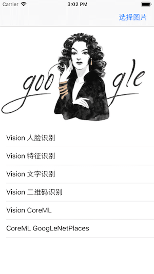
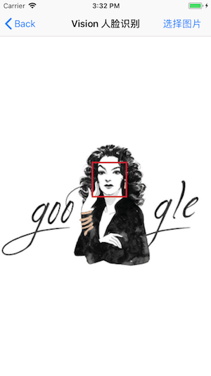
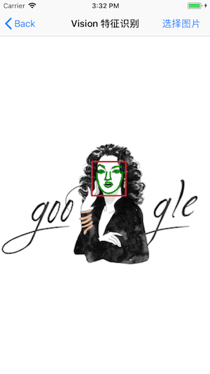
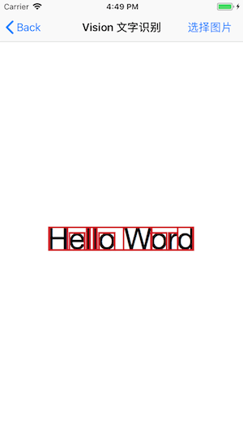

# CoreML Demo

[GoogLeNetPlaces.mlmodel](<https://github.com/Xiaoye220/Resources/blob/master/Demos/CoreML/GoogLeNetPlaces.mlmodel>) 文件过大未上传至 git 可自行下载后替换

### 目录：

### Vision 人脸识别：

### Vision 特征识别：

### Vision 文字识别：

