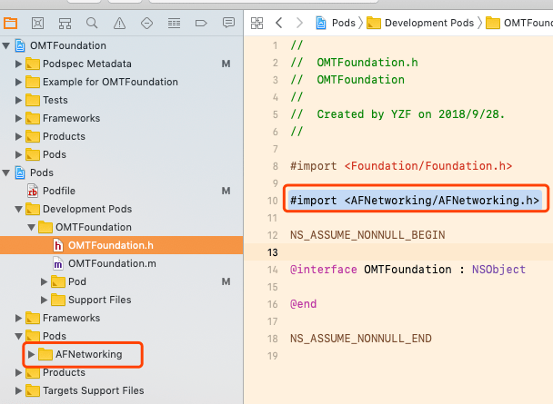
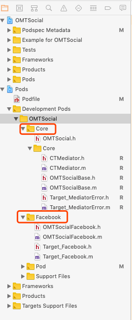
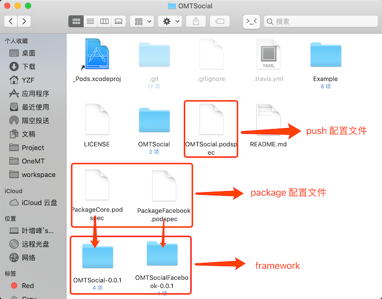

**介绍了通过 `pod package` 命令打包 framework，以及对具有依赖关系的多个 subspecs 分别打包成独立的 framework。**

**环境：**
* Xcode 10
* CocoaPods 1.6.0
* iOS 12


### 一、单个库打包

#### 1.创建项目

```bash
pod lib create YFFoundation
```

#### 2.添加文件、pod依赖

项目目录结构如下：



#### 3.根目录下创建打包用 .podspec 文件 (package.podspec)

##### 注意：
* 使用 `pod package` 打包需要一个 `.podspec` 文件指定需要打包的的文件，这里用 `package.podspec` 作为配置文件，代码如下
* `s.name` 表示要打包的 framework 的名字
* `s.source` 使用本地路径会 git 的commit的代码进行打包，因此代码更新后一定要 commit，否则会一直打包旧的。使用 git 路径会从 git 上 clone 代码再打包
* `s.source_files` 指定需要打包的文件
* `s.dependency` 指定打包文件的依赖

```ruby
# package.podspec
Pod::Spec.new do |s|
  s.name             = 'YFFoundation'
  s.version          = '0.0.1'
  s.summary          = 'A short description of YFFoundation.'

  s.description      = <<-DESC
TODO: Add long description of the pod here.
                       DESC

  s.homepage         = 'https://github.com/Xiaoye220/YFFoundation'
  s.license          = { :type => 'MIT', :file => 'LICENSE' }
  s.author           = { 'Xiaoye220' => '576934532@qq.com' }
  s.source           = { :git => '/Users/YZF/Desktop/CocoaPodsTest/YFFoundation' }

  s.ios.deployment_target = '7.0'

  s.source_files = 'YFFoundation/Classes/**/*'
  
  s.dependency 'AFNetworking'

end
```


#### 4.执行打包命令 - pod package

##### 注意：

* `–no-mangle` 表明本地组件依赖了静态库
* `–force` 表明强制覆盖上一次打包生成的文件(同版本)
* **`–exclude-deps`** 表明不包含所依赖的符号库，可以减少framework的大小，不加此参数的话如果主工程引入了多个私有库，会抛出 duplicate symbol 错误
* `--library` 生成静态.a
* `--embedded` 生成静态.framework
* `--dynamic` 生成动态.framework
* `--configuration` 表示生成的库是debug还是release，默认是release。--configuration=Debug
* 成功后会在当前目录下生成一个 `YFFoundation-0.0.1` 文件夹

```bash
pod package package.podspec --no-mangle --exclude-deps --spec-sources=https://github.com/CocoaPods/Specs.git --force
```

**在 Demo 的 YFFoundation 文件夹目录下执行以上命令可以看到效果**


#### 5.执行 pod push 发布 framework

##### 注意：

* 下面的 `.podspec` 文件可以通过 `ENV['lib']` 控制上传 framework 还是上传源码
* `pod repo push Specs` 会上传源码
* `lib=1 pod repo push Specs` 会上传 framework

```ruby
# YFFoundation.podspec
Pod::Spec.new do |s|
  s.name             = 'YFFoundation'
  s.version          = '0.0.1'
  
  # .... 省略

  if ENV['lib']
    s.ios.vendored_frameworks = 'YFFoundation-' + s.version + '/ios/YFFoundation.framework' 
  else
    s.source_files = 'YFFoundation/Classes/**/*'
  end

  s.dependency 'AFNetworking'

end
```

### 二、有依赖关系的 subspecs 分别打包成 framework

#### 1.创建项目

```bash
pod lib create YFSocial
```

#### 2.添加文件、pod依赖

subspec 的依赖关系：`Core` 为基础 subspec，`Facebook` 依赖 `Core`

项目目录结构如下：



#### 3.打包 subspec - Core

**由于一个 .podspec 只能生成一个 framework，因此每个 subspec 都要一个 .podspec 文件作为配置文件打包**

##### 注意：
* 创建 `PackageCore.podspec` 文件为打包 `Core` 提供支持，内容如下。

* `s.name` 应该为 YFSocial，这样其他模块才可以通过 `#import <YFSocial/YFSocial.h>` 引入头文件，并且 `Core` 编译成功后生成的为 `YFSocial.framework`

```ruby

# PackageCore.podspec
Pod::Spec.new do |s|
  s.name             = 'YFSocial'
  s.version          = '0.0.1'
  s.summary          = 'A short description of YFSocial.'

  s.description      = <<-DESC
TODO: Add long description of the pod here.
                       DESC

  s.homepage         = 'https://github.com/Xiaoye220/YFSocial'
  s.license          = { :type => 'MIT', :file => 'LICENSE' }
  s.author           = { 'Xiaoye220' => '576934532@qq.com' }
  s.source           = { :git => '/Users/YZF/Desktop/CocoaPodsTest/YFSocial'}

  s.ios.deployment_target = '7.0'

  s.subspec 'Core' do |sp|
     sp.source_files = 'YFSocial/Classes/*', 'YFSocial/Classes/Core/*'
  end
end
```

##### 执行打包命令

`--subspecs` 为把指定 subspecs的文件进行打包，可以添加多个

```bash
pod package PackageCore.podspec --no-mangle --exclude-deps --spec-sources=https://github.com/CocoaPods/Specs.git,https://github.com/Xiaoye220/Specs.git --force --subspecs=Core
```


**在 Demo 的 YFSocial 文件夹目录下执行以上命令可以看到效果**

#### 4.打包 subspec - Facebook

##### 注意：
* 创建 `PackageFacebook.podspec` 文件为打包 `Facebook` 提供支持，内容如下。

* ` s.subspec 'Facebook'` 中要使用上面完成的 `YFSocial.framework` ，需要通过 `sp.ios.vendored_frameworks = 'YFSocial-0.0.1/ios/YFSocial.framework'` 这种方式依赖。

* 除了上面那种方式使用 `YFSocial.framework`，还可以用 `sp.dependency 'YFSocial/Core'`，但是这个方法必须先发布 `YFSocial/Core` 才能正确依赖

* `Facebook` 中要导入 `Core` 中头文件，要使用 `#import <YFSocial/YFSocialBase.h>`，表示是从 `YFSocial.framework` 中导入。若是用 `#import "YFSocialBase.h"` 会找不到头文件。

```ruby
# PackageFacebook.podspec

Pod::Spec.new do |s|
  s.name             = 'YFSocialFacebook'
  s.version          = '0.0.1'
  s.summary          = 'A short description of YFSocial.'

  s.description      = <<-DESC
TODO: Add long description of the pod here.
                       DESC

  s.homepage         = 'https://github.com/Xiaoye220/YFSocial'
  s.license          = { :type => 'MIT', :file => 'LICENSE' }
  s.author           = { 'Xiaoye220' => '576934532@qq.com' }
  s.source           = { :git => '/Users/YZF/Desktop/CocoaPodsTest/YFSocial'}

  s.ios.deployment_target = '7.0'

  s.subspec 'Facebook' do |sp|
     sp.source_files = 'YFSocial/Classes/Facebook/*'
     sp.ios.vendored_frameworks = 'YFSocial-0.0.1/ios/YFSocial.framework'
     # sp.dependency 'YFSocial/Core'
  end

end
```

##### 执行打包命令

##### 注意：
* 打包后的 `YFSocialFacebook.framework` 会把 `YFSocial.framework` 中的头文件也添加进来，但是这些头文件仅仅做 `import` 时查找用，不影响其他。

```bash
pod package PackageFacebook.podspec --no-mangle --exclude-deps --spec-sources=https://github.com/CocoaPods/Specs.git,https://github.com/Xiaoye220/Specs.git --force --subspecs=Facebook
```

**在 Demo 的 YFSocial 文件夹目录下执行以上命令可以看到效果**

#### 5.发布

打包完成后的目录



执行 Push 命令

```bash
pod repo push Specs YFSocial.podspec --sources=https://github.com/CocoaPods/Specs.git,https://github.com/Xiaoye220/Specs.git --verbose --use-libraries --allow-warnings
```

### 三、自动打包脚本

以下文件都在 Demo 的 YFSocial 文件夹中

#### 1. package.podspec

为了避免每一个 subspec 都要一个 .podspec 文件才能打出指定名字的包，可以统一为一个 `package.podspec` 文件，根据传入的参数自动打出指定名称的包

##### 注意：
* `ENV['subspec']` 是传递参数用的，如指令 `subspec=Core pod package package.podspec .....`，那么 `ENV['subspec']` 的值为 "Core"
* `sp.dependency "#{s.name}/Core"`，倒数第三行这个表示依赖当前文件的 `Core` 这个 subspec。

```ruby
Pod::Spec.new do |s|

  # 从 ENV['subspec'] 获取当前要打包的 subspec 的 name
  subspec_name = ENV['subspec'].to_s
  # 根据 subspec_name 的不同生成不同的 s.name
  s_name = subspec_name == 'Core' ? 'YFSocial' : 'YFSocial' + subspec_name

  s.name             = s_name
  s.version          = '0.0.1'
 
  # ...... 其余不重要信息省略

  s.subspec 'Core' do |sp|
    # 打包 Core 使用源码，打包其他 subspec 使用 framework
    if subspec_name == 'Core'
      sp.source_files = 'YFSocial/Classes/*', 'YFSocial/Classes/Core/*'
    else
      sp.ios.vendored_frameworks = 'YFSocial-' + s.version.to_s + '/ios/YFSocial.framework'
    end
  end

  s.subspec 'Facebook' do |sp|
    sp.source_files = 'YFSocial/Classes/Facebook/*'
    sp.dependency "#{s.name}/Core"
  end
end
```

#### 2. package.sh

这是一个 `shell` 脚本，指定所有 subspec 的 name，可以自动化打包所有 subspec 并发布

##### 注意
* 第一行声明用于 `pod repo push` 用的 .podspec 文件名
* 第二行用一个数组声明所有的 subspec
* 熟悉 shell 脚本的，上面的数据也可以通过指令从实际 `YFSocial.podspec` 中获取，实现完全自动化。我这里只是简单手写赋值。
* Demo 中执行该脚本可以看到会自动将所有 subspec 打包成 framework

```bash
push_podspec_name=YFSocial.podspec

subspecs=(Core Facebook)

podspec_path=$PWD/$push_podspec_name

# 获取版本号
version=`grep -E "s.version |s.version=" $podspec_path | head -1 | sed 's/'s.version'//g' | sed 's/'='//g'| sed 's/'\"'//g'| sed 's/'\''//g' | sed 's/'[[:space:]]'//g'`


for subspec in ${subspecs[@]}
do
  # 打包指令
  subspec="${subspec}" pod package package.podspec --subspecs="${subspec}" --no-mangle --exclude-deps --force  --spec-sources=https://github.com/CocoaPods/Specs.git,https://github.com/Xiaoye220/Specs.git

  # 打包完 commit，避免 package 时还是使用旧的代码
  git add .
  git commit -m "package ${subspec}"
done


git push origin master

git tag -d $version
git push origin :refs/tags/$version

git tag -a $version -m $version
git push origin --tags
pod cache clean --all

pod repo push Specs "${push_podspec_name}" --use-libraries --allow-warnings --verbose --sources=https://github.com/CocoaPods/Specs.git,https://github.com/Xiaoye220/Specs.git 
```