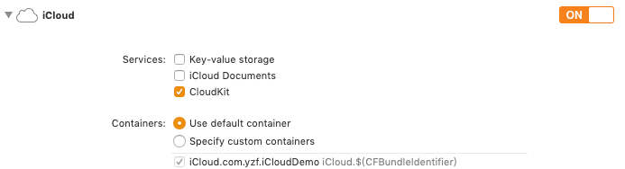

## CloudKit

### 1.添加 iCloud 支持



打开 [dashboard](https://icloud.developer.apple.com/dashboard/) 就可以看到添加的 Container 了

### 2.实体类

#### 2.1 CKContainer

一个应用对应一个容器，容器 `identifier` 为上面添加的 

#### 2.2 CKDatabase

一个 app container 可以有三种类型的 database

* publicCloudDatabase：必有的，对任何设备通用，可以在  [dashboard](https://icloud.developer.apple.com/dashboard/)  查看，数据计入 app 的 iCloud 空间，无法使用 customZone
* privateCloudDatabase ：只能自己的设备访问，无法在  [dashboard](https://icloud.developer.apple.com/dashboard/)  查看别人的数据，数据计入用户个人的 iCloud 空间。把想要分享给别人的数据保存至 customZone，defaultZone 中的数据无法分享
* sharedCloudDatabase：iOS 10 后新增，只允许通过 `CKShare` 授权的用户访问，无法在  [dashboard](https://icloud.developer.apple.com/dashboard/)  查看别人的数据，数据计入 app 的 iCloud 空间。可以查看别人 privateCloudDatabase 中分享给你的数据

#### 2.3 CKRecordZone

无法在 publicCloudDatabase 使用，可以通过添加自定义的 Zone 对数据进行归类

```swift
let database = CKContainer.default().privateCloudDatabase
// creating acCustom record zone
let customZone  = CKRecordZone(zoneName: "customZone")
database.save(customZone) { (zone, error) in
 	// TODO:
}
// save record to the zone
let zoneID = CKRecordZone.ID.init(zoneName: "customZone", ownerName: CKCurrentUserDefaultName)
let recordID = CKRecord.ID.init(recordName: recordName, zoneID: zoneID)
let record = CKRecord(recordType: recordType, recordID: recordID)

database.save(record) { (record, error) in
    // TODO:
}
```

#### 2.4 CKRecord

数据实体类，所有的增删改查都是通过这个类实现

`CKRecord.ID` 通过一个 recordName 初始化，recordName 为一条数据的唯一标识符，若是不指定，那么会生成一串随机字符串作为 recordName

#### 2.5 CKReference

表示实体间的关系，如一对一，一对多等


### 3.订阅数据修改的通知

推送在模拟器上是无法使用的，可以在真机上订阅后，在后台直接修改数据或者通过模拟器修改数据，在真机上观察是否有推送到达

#### 3.1 Save Subscriptions to the Database

以下会将一个订阅添加到 Database，每当 `name = "Tommy"` 的数据创建、删除、更新的时候，会接收到推送通知

```swift
let predicate = NSPredicate(format: "name == %@", "Tommy")
let subscription = CKQuerySubscription(recordType: recordType, predicate: predicate, subscriptionID: subscriptionID, options: [CKQuerySubscription.Options.firesOnRecordDeletion, CKQuerySubscription.Options.firesOnRecordCreation, CKQuerySubscription.Options.firesOnRecordUpdate])

let notificationInfo = CKSubscription.NotificationInfo()
notificationInfo.shouldSendContentAvailable = true
notificationInfo.alertBody = "Tommy"
notificationInfo.shouldBadge = true

subscription.notificationInfo = notificationInfo

CKContainer.default().publicCloudDatabase.save(subscription) { (subscription, error) in
    // TODO:
}
```

> 注意：
>
> If you don’t set any of the [`alertBody`](apple-reference-documentation://hsfhkhaAPE), [`soundName`](apple-reference-documentation://hshfePtlZ7), or [`shouldBadge`](apple-reference-documentation://hsE3e74D9F) properties, the push notification is sent at a lower priority that doesn’t cause the system to alert the user.

#### 3.2 Register for Push Notifications

iOS 10 之后的推送注册

```swift
import UserNotifications

UNUserNotificationCenter.current().requestAuthorization(options: [.alert, .sound, .badge]) { (accepted, error) in
    // TODO:
}
```

```swift
func application(_ application: UIApplication, didFinishLaunchingWithOptions launchOptions: [UIApplication.LaunchOptionsKey: Any]?) -> Bool {
    application.registerForRemoteNotifications()
    return true
}
```

#### 3.3 Handle Push Notifications in Code

```swift
func application(_ application: UIApplication, didReceiveRemoteNotification userInfo: [AnyHashable : Any]) {
    let cloudKitNotification = CKNotification(fromRemoteNotificationDictionary: userInfo)
    if(cloudKitNotification?.notificationType == CKNotification.NotificationType.query) {
        let queryNotification = cloudKitNotification as! CKQueryNotification
        let recordID = queryNotification.recordID
		// TODO:
    }
}
```